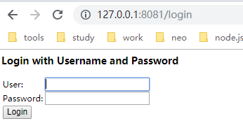

# 授权模式

### 配置pom.xml
    ```$xml
    <dependency>
        <groupId>org.springframework.boot</groupId>
        <artifactId>spring-boot-starter-security</artifactId>
    </dependency>
    <dependency>
        <groupId>org.springframework.security.oauth</groupId>
        <artifactId>spring-security-oauth2</artifactId>
        <version>2.3.3.RELEASE</version>
    </dependency> 
    ```
### 配置webSecurity
- 自定义WebSecurityConfig继承WebSecurityConfigurerAdapte
    - 重写构造方法
       ```$java
        @Override
        protected void configure(AuthenticationManagerBuilder auth) throws Exception {
            super.configure(auth);
        }
        @Override
        protected void configure(HttpSecurity http) throws Exception {
            super.configure(http);
        }
        @Override
        public void configure(WebSecurity web) throws Exception {
            super.configure(web);
        }
        ```
    - 注入用户信息bean
        ```$java
        @Bean
        @Override
        protected UserDetailsService userDetailsService() {
            User.UserBuilder builder = User.builder();
            //TODO 
            //此处使用in-memory存储用户信息
            return new InMemoryUserDetailsManager(user, admin);
        }
        ```

### 配置授权服务器
- 配置security
    ```$java
    @Override
    public void configure(AuthorizationServerSecurityConfigurer securiry) throws Exception {
        super.configure(securiry);
    }
    ```
- 配置客户端信息
    ```$java
    /** 客户端信息配置*/
    @Override
    public void configure(ClientDetailsServiceConfigurer clients) throws Exception {
        clients.inMemory()
                .withClient("my-client-1")
                .secret("$2a$10$0jyHr4rGRdQw.X9mrLkVROdQI8.qnWJ1Sl8ly.yzK0bp06aaAkL9W")
                .authorizedGrantTypes("authorization_code","refresh_code")
                .scopes("all")
                .redirectUris("http://www.baidu.com");
    }
    ```
- 配置端点
    ```$java
    @Override
    public void configure(AuthorizationServerEndpointsConfigurer endpoints) throws Exception {
        super.configure(endpoints);
    }
    ```
### 启动测试
- 创建启动类
    ```$java
    @SpringBootApplication
    public class AuthCodeServerApplication {
        public static void main(String[] args) {
            SpringApplication.run(AuthCodeServerApplication.class,args);
        }
    }
    ```
- 启动后可见当前服务包含如下默认端点
    - /oauth/authorize 授权端点
    - /oauth/token 令牌端点
    - /oauth/check_token 
    - /oauth/confirm_access]
    - /oauth/error
- 授权端点测试
    - 获取授权许可请求 点击authorize
    
        
    - 输入账号用户账号密码确认授权
    
        
    - 确认后跳转 www.baidu.com
        > 获取到的授权码 code= ID7uA3  客户端状态值state被原样带回
        
        
- 令牌端点测试
    - Authorization = **Basic+空格+Base64.getEncoder().encodeToString("client_id:client_secret".getBytes())**  
    - redirect_uri与请求授权许可时一致
    
    
    


